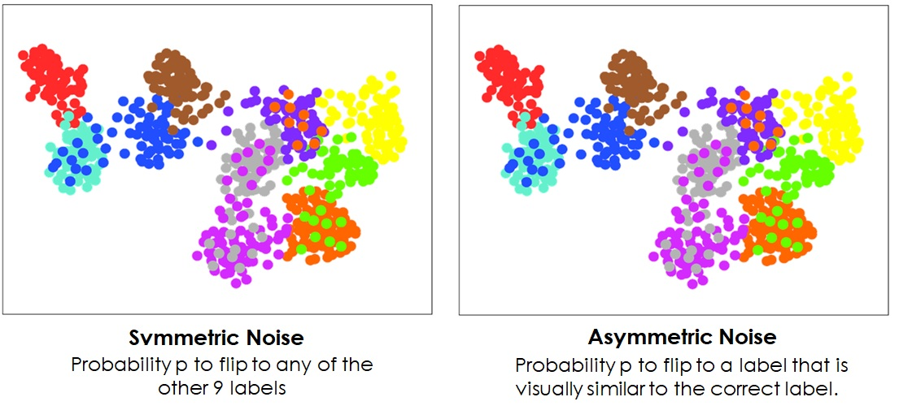
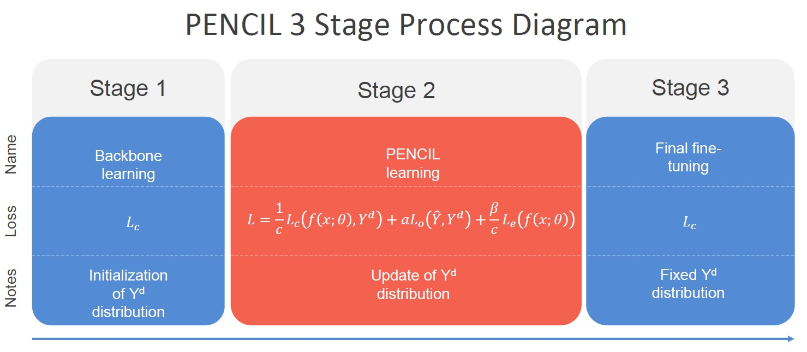
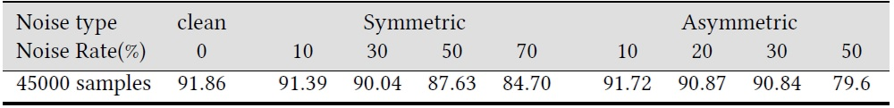

# PENCIL
PyTorch implementation of [Probabilistic End-to-end Noise Correction for Learning with Noisy Labels](https://arxiv.org/abs/1903.07788), CVPR 2019.

## Summary

  - [Description of the problem](#description-of-the-problem)
  - [Description of the repository](#description-of-the-repository)
  - [Requirements](#requirements)
  - [Usage](#usage)
  - [Experiments](#experiments)
  - [Results](#results)
  - [Acknowledgments](#acknowledgments)

## Description of the problem

### Description of label noise problem

Label or class noise is a common problem in datasets. There are 2 main cases of label noise. First case is symmetric or uniform or 𝑦-independent label noise, where a label changes to any of the other labels, with probability 𝑝. Second case is asymmetric noise or 𝑦-dependent, where a label changes to another specific label from the others, that is, on a label that looks like the original clean label. So it models the case where in the real world 2 labels are confused because they look similar.

The following image shows the above types of noise, for a 10-class problem ploting the embedding representation of penultimate layer of a neural network and reduce the size to 2D.



### Description of PENCIL framework
PENCIL is a method for reducing the effect of noise on classification performance by automatic label correction during training. This is achieved by treating the noisy labels as parameters of the learning model, which are updated through backpropagation. More specifically, the model updates both network parameters and label estimates as label distributions.

PENCIL consists of 3 stages of training as shown in the image below:



Τhe correction of the labels is done in the 2nd stage. Thus, two consecutive steps are performed in every training iteration: 1) update weights of network using Stochastic Gradient Descent with fixed labels and 2) update distributions of labels through backpropagation with fixed weights of the network.

**Due to the limitations of github markdown language in the representation of mathematical symbols, it is advisable to refer to the original paper for more details.**

## Description of the repository

```
    .
    ├── data                    # contains folders for each dataset separately
    │   ├── cifar10
    │   ├── cifar100
    │   ├── cub200_2011
    |   └── clothing1M
    ├── utils                   # help functions
    │   ├── cifar10.py          # definition for Cifar10 dataset class
    │   ├── cifar100.py         # definition for Cifar100 dataset class
    │   ├── cub200_2011.py      # definition for CUB200 dataset class
    │   ├── clothing1M.py       # definition for Clothing1M dataset class
    |   └── mypreactresnet.py   # definition for preact ResNet32 model
    ├── PENCIL.py             # implementation of PENCIL framework
    └── ...
```

## Requirements
    python = 3.7.4
    numpy = 1.17.3
    pytorch = 1.4.0
    torchvision = 0.5.0
    matplotlib = 3.1.1
    pillow=6.2.0
    
The below packages are necessary only for CUB200 and Clothing1M datasets

    skimage = 1.3.1
    scikit-learn = 0.26
    pandas = 0.25.1
    
## Usage
Examples for running the method are :

    python PENCIL.py --arch preact_resnet32 --dataset cifar10 --noise clean --noise_rate 0.0 --lr 0.02 --alpha 0.1 --beta 0.8 --lambda1 200 --run-without-validation --seed 2020
    
    python PENCIL.py --arch preact_resnet32 --dataset cifar10 --noise symmetric --noise_rate 0.3 --lr 0.03 --alpha 0.1 --beta 0.8 --lambda1 300 --run-without-validation --cseed 2020

    python PENCIL.py --arch preact_resnet32 --dataset cifar10 --noise asymmetric --noise_rate 0.5 --lr 0.03 --alpha 0 --beta 0.4 --lambda1 4000 --run-without-validation --seed 2020

    python PENCIL.py --arch resnet34 --dataset cifar100 --noise symmetric --noise_rate 0.3 --classnum 100 --lr 0.35 --alpha 0.1 --beta 0.4 --lambda1 1000 --run-without-validation --seed 2020

    python PENCIL.py --arch resnet34 --dataset CUB200_2011 --stage1 35 --stage2 100 --epochs 160 --batch-size 16 --workers 32 --wd 1e-4 --noise clean --noise_rate 0.0 --classnum 200 --lr 2e-3 --lr2 1e-3 --alpha 0.0 --beta 0.8 --lambda1 3000 --run-without-validation --seed 2020

    python PENCIL.py --arch resnet34 --dataset clothing1M --stage1 5 --stage2 15 --epochs 25 --batch-size 32 --workers 32 --wd 0.001 -p 1000 --noise symmetric --noise_rate 0.4 --classnum 14 --lr 1.6e-3 --lr2 5e-4 --alpha 0.08 --beta 0.8 --lambda1 3000 --run-without-validation --seed 2020


## Experiments

For our experiments we used the CIFAR-10 data set. We dealed with symmetric and asymmetric noise, as mentioned in description and followed the procedure applied in original paper for introducing noise. Let the noise percentage of the labels is 𝑝 ∈ [0, 1]. In the case of symmetric noise, a label is changed to one of all the other 9 classes with probability 𝑝, while remains clean with probability 1−𝑝. As for the asymmetric noise, the changes in a class can be made according to the following correspondences: bird->plane, truck->car, deer -> horse and cat <-> dog. That is, labeling errors correspond to classes that have visual similarities. Finally we used the same settings with the implementation of the original PENCIL for the experinments.

## Results

The following table shows the results for running PENCIL for different noise types and noise rates 𝑝.



## Acknowledgments
https://github.com/yikun2019/PENCIL/blob/master/README.md

https://arxiv.org/abs/1903.07788
